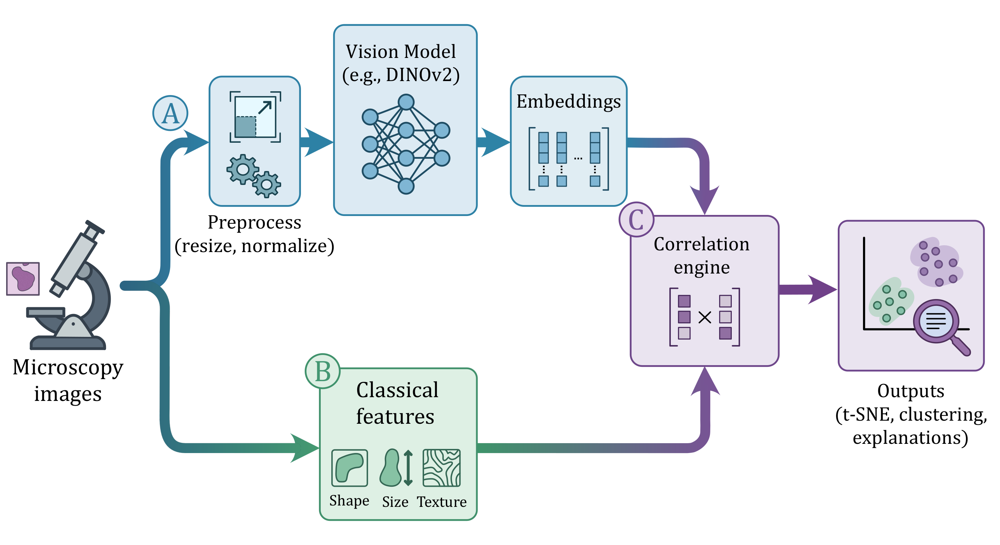

# PhenoMe

<p align="center">
  
</p>

<p align="center">
    <a href="https://AAitorG.github.io/PhenoMe/"></a>
    <a href="https://colab.research.google.com/github/AAitorG/PhenoMe/blob/main/Notebooks/tutorials/01_interactive_quickstart.ipynb"></a>
</p>

A modular, **dataset-agnostic** and **model-agnostic** framework for phenotyping analysis using deep learning embeddings (**visual fingerprints**) and extracted image properties.

<p align="center">
  
</p>

### 🛠️ How it works
PhenoMe processes images through a dual-path pipeline visualized above:
1.  **Discover** (Input): Find raw images and extract experimental metadata.
2.  **Embed** (Branch A): Deep learning extraction (preprocessing → vision model → visual fingerprints).
3.  **Properties** (Branch B): Parallel extraction of interpretable features (shape, intensity, texture).
4.  **Analyze** (Correlation C): The correlation engine merges both branches to generate distances, interactive plots, and reports.

---

## ✨ Features

- **Model Agnostic**: Extract embeddings using DINOv2 or any custom PyTorch vision model.
- **Dataset Agnostic**: Works with any image dataset structure with customizable metadata extraction.
- **Analysis Toolkit**: Distance quantification, anomaly detection, property extraction, and correlation analysis.
- **Interactive Visualizations**: High-performance Plotly-based PCA, t-SNE, and UMAP plots.
- **Automated Reporting**: Generate comprehensive standalone HTML reports.

---

## 🚀 Quick Start

Analyze your images in four simple steps:

```python
from phenome import PhenoMe, load_dinov2_model

# 1. Setup: Load a vision model (DINOv2)
# device=torch.device("cuda") set device to GPU if available for faster processing
wrapper = load_dinov2_model()  # pass device as needed
pheno = PhenoMe() # pass device as needed

# 2. Load: Find your images
pheno.find_files("path/to/images")

# 3. Analyze: Extract visual fingerprints and compute properties
pheno.process_images(wrapper)
pheno.compute_properties(property_preset="basic")

# 4. Explore: Launch an interactive dashboard
pheno.create_interactive_explorer()
```

For a no-code experience, try the **[Interactive Quickstart](Notebooks/tutorials/01_interactive_quickstart.ipynb)** or run it directly in **[Google Colab](https://colab.research.google.com/github/AAitorG/PhenoMe/blob/main/Notebooks/tutorials/01_interactive_quickstart.ipynb)**.

---

## Installation

```bash
git clone https://github.com/AAitorG/PhenoMe.git
cd PhenoMe
```

**conda** — pick **CPU** or **GPU**:

```bash
# CPU-oriented env (default Conda setup)
conda env create -f envs/environment-cpu.yml
conda activate phenome-cpu

# GPU-oriented env
conda env create -f envs/environment-gpu.yml
conda activate phenome-gpu
```

**pip** — pick **CPU** or **GPU**:

```bash
# CPU-oriented env
pip install -r requirements.txt -e .

# GPU-oriented env
pip install -r envs/requirements-gpu.txt -e .
```

> **Note:**
> From the repository root, `requirements.txt` acts as a convenient alias to `envs/requirements-cpu.txt` for CPU-oriented environments. On **Windows**, `pykeops` is gracefully omitted.
>
> See [Getting started](https://AAitorG.github.io/PhenoMe/getting-started/) for GPU setup details, verification commands, and first-analysis walkthroughs.

---

## 📖 Documentation

**Explore the [Live Documentation Website](https://AAitorG.github.io/PhenoMe/)** for detailed guides, API references, and tutorials.

**Source:** Markdown under [`docs/src/content/docs/`](docs/src/content/docs/).

### New users (install → data → notebooks)

| Step | Link |
|------|------|
| 1. Install | [Getting started](https://AAitorG.github.io/PhenoMe/getting-started/) · [Quick start card](https://AAitorG.github.io/PhenoMe/quick-start-card/) |
| 2. Set up your data | [Data setup](https://AAitorG.github.io/PhenoMe/guides/data-setup/) · [Experiment details](https://AAitorG.github.io/PhenoMe/guides/experiment-details/) |
| 3. Tutorials | [Notebooks/tutorials/](Notebooks/tutorials/) (start with **01**, then **02**–**03**) · [Learning paths](https://AAitorG.github.io/PhenoMe/user-paths/) |

**Concepts and examples:** [Core concepts](https://AAitorG.github.io/PhenoMe/concepts/) · [Workflows](https://AAitorG.github.io/PhenoMe/workflows/) · [Examples](https://AAitorG.github.io/PhenoMe/examples/) · [FAQ](https://AAitorG.github.io/PhenoMe/faq/) · [Glossary](https://AAitorG.github.io/PhenoMe/glossary/)

### Developers

- **[Architecture](https://AAitorG.github.io/PhenoMe/guides/architecture/)** — packages and extension points.
- **[Reference index](https://AAitorG.github.io/PhenoMe/advanced/)** — narrative API pages and the HDF5 database protocol.
- **[API from code](https://AAitorG.github.io/PhenoMe/advanced/api/pipeline/)** — regenerated from docstrings on each docs build (see [Developer guide](https://AAitorG.github.io/PhenoMe/guides/developer-guide/)).
- **[Custom properties](https://AAitorG.github.io/PhenoMe/guides/custom-properties/)** · **[Extending](https://AAitorG.github.io/PhenoMe/guides/extending/)** · **[Testing](https://AAitorG.github.io/PhenoMe/guides/testing/)**

---

## Author

**Aitor González-Marfil** — [@AAitorG](https://github.com/AAitorG)

## Citation

```bibtex
@software{phenome,
  author = {Aitor González-Marfil},
  title = {PhenoMe: Model-Agnostic Deep Learning-Based Phenotyping Analysis},
  year = {2026},
  url = {https://github.com/AAitorG/PhenoMe}
}
```
